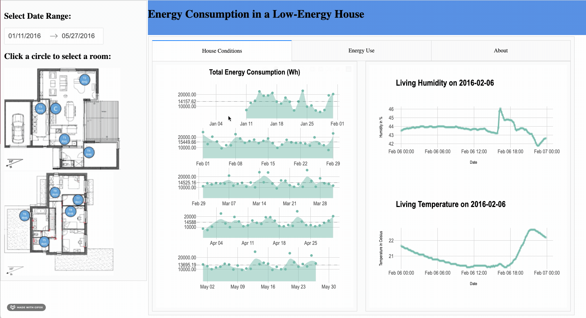

# Belgium's Energy Consumption Visualization in R (Group B)

### Deployed App Link

[r-prototype](https://r-prototype.herokuapp.com/)

## Who are we

- Chad: "An intelligent and witty person that works on the betterment of oneself and those around him." -Jacob
- Harpreet: Passionate mathematician on the path of becoming a statistician.
- Nelson: Definitely a data engineer on my right track in the near future.
- Nyanda:  Life long learner vested with a growth mentality.

## What are we doing and Why

We built a dashboard to visualize data related to a low energy-house in Belgium. Our purpose is to provide analytical insights, visually, for ease of use in cases such as the determination of the adequate photovoltaic and energy storage size. The target audience is the Belgium's energy management system. This is particularly true in the context of diminishing the inflow of power to the grid across the four seasons. This is premised on avoiding power balckouts. On the ground, this could be of immediate use to electricity grid operators in their calculations as they strategize how to avoid power blackouts.

What is unique about our proposal is the use of a low-energy household to generate the data. This usage could be valuable in deciding upon a minimum threshold for energy consumption per household. This can be of further use in managing load control within unforseen emergency situations as well as in the creation of backup systems.

Our app allows users, such as an operator's supervising team, to flexibly filter their search and view different aspects of the data by filtering and re-ordering on different variables.

## How can you get involved

If you are interested in analyzing the variation of temperature and energy consumption for parts of the winter season(January to February) or parts of the the spring season(March to April), this dashboard can be of help.

With this dashboard, you recieve an interactive layout of various charts that represent several different types of information related to energy consumption. Using the floorplan image, you can select a room and select the duration for which you would like to view the variations within the temperature, level of humidity and the energy consumption.

This dashboard provides you with concise reports based on day(s), week(s), and month(s). This supports analytical interests related to energy management systems within the context of a low-energy house in Belgium. For example, the vizualizations offer the granularity for comparitive insights based on weekend energy consumption versus weekday energy consumption.

## Insight into data

The data set was donated in the year 2017 by Luis Candanedo, University of Mons (UMONS). It was collected to create regression models of appliances energy use in a low energy building in Belgium. Our dataset includes approximately, 20000 temperature and humidity sensors measurements from a ZigBee wireless network, outside weather conditions (`To` and `RH_out`, `Wind speed`, `Visibility`, `Tdewpoint`) from a nearby airport station (Chievres Airport, Belgium), and recordings of the energy consumed by the lighting fixtures and other appliances operated by the people residing in that house. The recordings have been recorded at 10 min for about 4.5 months (i.e. from January 11, 2016 to May 27, 2016) in a low-energy building. The node transmitted the temperature recording (`T1` to `T9`) in Celsius and humidity (`RH_1` to `RH_9`) in % for every individual room in the house around every 3.3 minutes which were then averaged for 10 minutes periods. The energy data for both appliances (`Appliances`) and lights (`lights`) separately was logged every 10 minutes with m-bus energy meters in the Wh unit. 

## How to get started with this dashboard

The tabs focuses on depicting the level of energy consumption and the humidity, temperature variation as per the selections. The dashboard offers dynamic room and date range selection. 
If you are interested in knowing about the level of room temperature and humidity, floorplan selection would be yout tool. You can make a selection of a room from the floorplan image by clicking over any blue circle. 
You have flexibility to select the date range for the span till the possible range selection(due to data restrictions). This selection would help to see the variations in the plot across all the tabs. This would serve the purpose for you to identify the energy required during a particular season, any particular holiday month. 
Since the date had every 10minutes recording you could dig deep into a week`s energy consumption analysis. In addition to this, compare the weekdays energy consumption report and maintain a balance of the photovoltaic.

## Acknowledgements and references 

- http://archive.ics.uci.edu/ml/datasets/Appliances+energy+prediction
- https://www.sciencedirect.com/science/article/abs/pii/S0378778816308970?via%3Dihub
